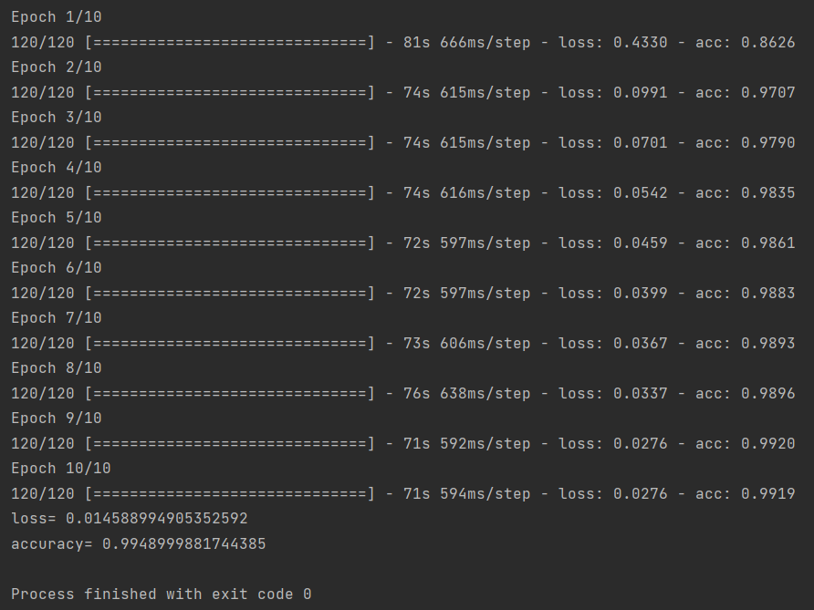

## Лабораторная работа №1
### Реализация системы распознавания рукописных цифр 
##### Задание
>Реализуйте систему распознавания рукописных цифр (можно использовать датасет MNIST). Должна быть использована сверточная сеть и подход data augmentation при обучении. Вероятность правильного распознавания на тестовой выборке должна быть больше 99%.

##### Ход работы
* Установка зависимости - tensorflow. 
* Установка dataset MNIST.
* Релизация кода
> Data augmentation - функция train_generator - выбрала поворот изображения

#### Результаты программы

#### Вывод
В данной лабораторной работе удалось достичь максимальной вероятности 99.28% на тестовой выборке.  